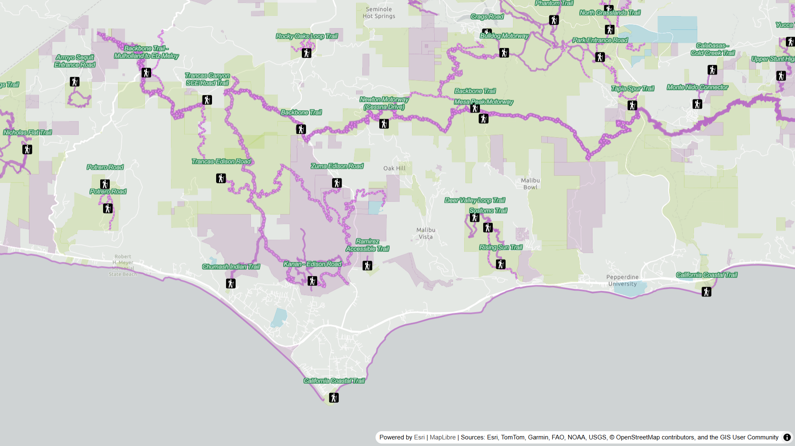

[![apache 2.0 licensed][license-img]][license-url]

[license-img]: https://img.shields.io/badge/license-Apache%202.0-orange.svg?style=flat-square
[license-url]: #license

# @esri/maplibre-arcgis

A MapLibre GL JS plugin for integrating with ArcGIS services, including basemaps, vector tiles, and feature layers.

> This project is maintained with ❤️ by folks at Esri, but we provide no guarantee of individual features, nor a traditional product lifecycle to support planning.



## Table of contents

- [@esri/maplibre-arcgis](#esrimaplibre-arcgis)
  - [Quick start](#quick-start)
  - [Features](#features)
  - [Tutorials and API reference](#tutorials-and-api-reference)
  - [Issues](#issues)
  - [Dependencies](#dependencies)

## Quick start

MapLibre ArcGIS is available via ESM and CDN. Once imported, the library can be used to display a basemap style and add layers.

```js
  import maplibregl from 'maplibre-gl';
  import maplibreArcGIS from '@esri/maplibre-arcgis';

  // Initialize MapLibre GL JS map
  const map = new maplibregl.Map({
    container: "map",
    zoom: 5,
    center: [138.2529, 36.2048],
  });

  // Apply an ArcGIS basemap style to the map
  const basemapStyle = maplibreArcGIS.BasemapStyle.applyStyle(map, {
    style: 'arcgis/navigation',
    token: apiKey
  });

  // Listen for the map 'load' event.
  map.on('load', async () => {
    // Add a vector tile layer using an ArcGIS Item ID.
    const vectorLayer = await maplibreArcGIS.VectorTileLayer.fromPortalItem('b8f6941ceb874d72a7c37418c3e8108d');
    vectorLayer.addSourcesAndLayersTo(map);
  });
```

For a complete example, go to the developer guide: [Maplibre ArcGIS quick start](https://developers.arcgis.com/maplibre-gl-js/get-started/).

## Features

MapLibre ArcGIS provides layers and utilities for accessing ArcGIS resources in a MapLibre GL JS application. In addition to the wide variety of basemap styles offered by ArcGIS, this package also allows you to access and display your own hosted data using MapLibre GL JS. The following resources are supported:

* Basemap styles ([`BasemapStyle`](/))
* Feature layers and feature services as GeoJSON ([`FeatureLayer`](/))
* Vector tile layers ([`VectorTileLayer`](/))
* Session tokens authentication for ArcGIS basemap styles ([`BasemapSession`](/))

## Tutorials and API reference

Tutorials, samples, and API reference can be found at [developers.com/maplibre-gl-js](https://developers.arcgis.com/maplibre-gl-js/).

<!--## Frequently asked questions

TODO-->

## Issues

Find a bug? Want a new feature? Let us know by submitting an [issue](https://github.com/Esri/maplibre-arcgis/issues).

For more help, you can post on the open source forum of [Esri Community](https://community.esri.com/t5/open-source-mapping-libraries/ct-p/open-source-mapping-libraries) or contact [Esri Technical Support](https://support.esri.com/en-us/contact).

## Dependencies

* [maplibre-gl-js](https://github.com/maplibre/maplibre-gl-js/) is a required peer dependency.
* ArcGIS REST JS is used internally:
    * [arcgis-rest-request](https://github.com/Esri/arcgis-rest-js/tree/main/packages/arcgis-rest-request)
    * [arcgis-rest-feature-service](https://github.com/Esri/arcgis-rest-js/tree/main/packages/arcgis-rest-feature-service)
    * [arcgis-rest-portal](https://github.com/Esri/arcgis-rest-js/tree/main/packages/arcgis-rest-portal)
    * [arcgis-rest-basemap-sessions](https://github.com/Esri/arcgis-rest-js/tree/main/packages/arcgis-rest-basemap-sessions)

---

## Contributing

Esri welcomes contributions from anyone and everyone. Please see our [guidelines for contributing](/CONTRIBUTING.md).

### Development instructions

To start developing locally:

1. [Fork and clone this repo](https://docs.github.com/en/pull-requests/collaborating-with-pull-requests/working-with-forks/fork-a-repo).
2. `cd` into the `maplibre-arcgis` folder.
3. Install build dependencies with `npm install`.
4. Use `npm run build:dev` to build the files locally for development. Output is saved to the `/dist` folder.
5. Alternatively, use `npm run start:dev` to start a development server. Files are rebuilt automatically when changes to the source code are made.
6. Change the library as desired and use `npm run test` to validate.

If you'd like to contribute to this repository, create a [pull request](https://docs.github.com/en/pull-requests/collaborating-with-pull-requests/proposing-changes-to-your-work-with-pull-requests/creating-a-pull-request) containing your work.

### Versioning

For transparency into the release cycle and in striving to maintain backward compatibility, Esri MapLibre is maintained under Semantic Versioning guidelines and will adhere to these rules whenever possible.

For more information on SemVer, please visit http://semver.org/.

## Credit

This project was inspired by several existing bodies of work, including:
* The [ArcGIS x MapLibre GL JS developer guide](https://developers.arcgis.com/maplibre-gl-js/)
* The [mapbox-gl-esri-sources](https://github.com/frontiersi/mapbox-gl-esri-sources) and [mapbox-gl-arcgis-featureserver](https://github.com/rowanwins/mapbox-gl-arcgis-featureserver) plugins
* The [ArcGIS Maps SDK for JavaScript](https://developers.arcgis.com/javascript/latest/)

Concepts and programming patterns were used for inspiration, but all code is original.

## Licensing

Copyright © 2025 Esri

Licensed under the Apache License, Version 2.0 (the "License"); you may not use this file except in compliance with the License. You may obtain a copy of the License at

> http://www.apache.org/licenses/LICENSE-2.0

Unless required by applicable law or agreed to in writing, software distributed under the License is distributed on an "AS IS" BASIS, WITHOUT WARRANTIES OR CONDITIONS OF ANY KIND, either express or implied. See the License for the specific language governing permissions and limitations under the License.

A copy of the license is available in the repository's [LICENSE](/LICENSE) file.
